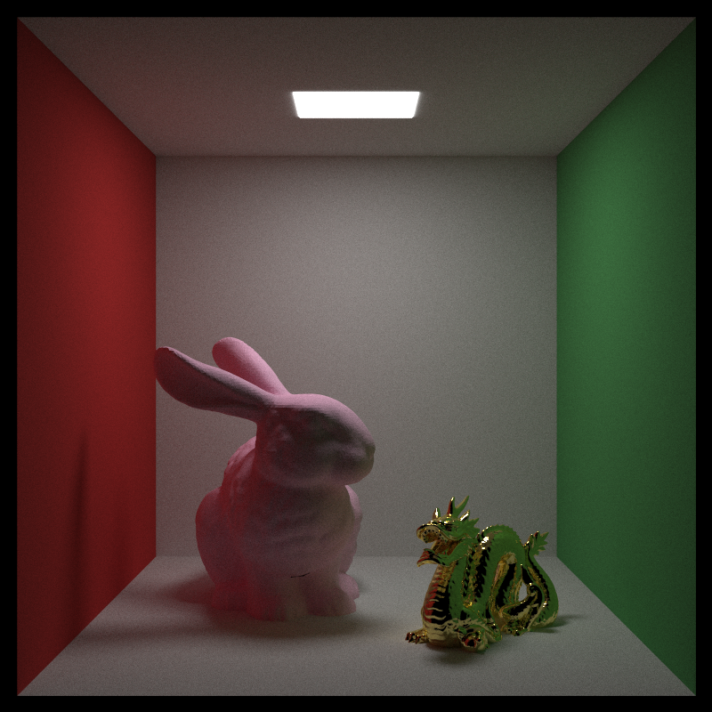

# CPP-Raytracer

A ray tracer written in C++ to experiment with math and computer graphics concepts. <br />

## Renders



## Build Dependencies
g++ (or any other C++ compiler with C++17 support) <br />

## Installation

Clone the repository locally.

```bash
git clone https://github.com/jibrilfdev/cpp-raytracer.git
cd cpp-raytracer
g++ src/main.cpp -fopenmp -o main
```

## Usage

(Render scene 13 and save it to a PPM file named output.ppm)
```bash
./main 13 > output.ppm
```

### Predefined scenes
0 - Bouncing spheres <br />
1 - Checkered spheres <br />
2 - Earth <br />
3 - Perlin Noise spheres <br />
4 - Quadrilaterals <br />
5 - Basic light <br />
6 - Empty Cornell Box <br />
7 - Cornell Box <br />
8 - Cornell Box Smoke <br />
9 - "Everything So Far Scene" <br />
10 - Stanford Dragon <br />
11 - Stanford Bunny <br />
12 - Cornell-Stanford Box <br />
13 - Guitar <br />


## Contributing

Pull requests are welcome. Issues are welcome, and will likely be addressed.

## License

[MIT](https://choosealicense.com/licenses/mit/)
