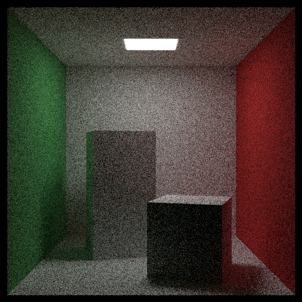
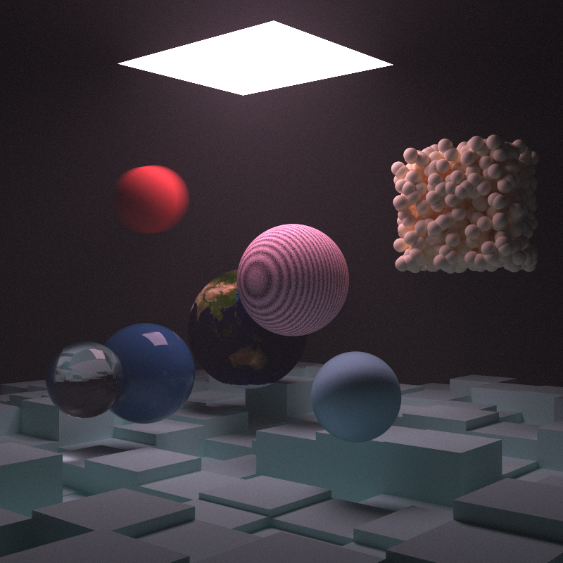

# CPP-Raytracer

A ray tracer written in C++ to experiment with math and computer graphics concepts. <br />





## Build Dependencies
g++ <br />

## Installation

Clone the repository locally.

```bash
git clone https://github.com/jibrilfdev/cpp-raytracer.git
cd cpp-raytracer
g++ src/main.cpp -fopenmp -o main
```

## Usage

```bash
./main > output.ppm
```

## Contributing

Pull requests are welcome. Issues are welcome, and will likely be addressed.

## License

[MIT](https://choosealicense.com/licenses/mit/)
